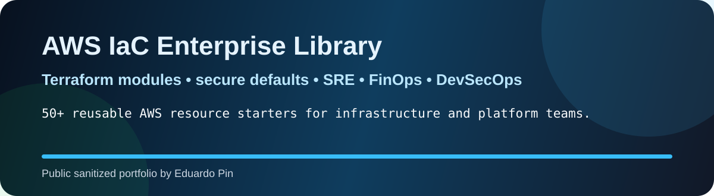
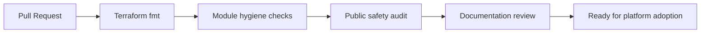

<p align="center">
  
</p>

<p align="center">
  
  
  
  
  
</p>

## What this is

A public, sanitized and reusable **AWS Infrastructure as Code utility library** built to demonstrate how a platform team can organize Terraform modules, examples, standards, guardrails and operational documentation.

This repository is designed to be useful for engineers and legible to recruiters. It emphasizes **clean structure, repeatability, cost governance, secure defaults, operational readiness and documentation quality**.

> This is portfolio code. It does not contain employer code, customer data, internal architecture or credentials.

## Module catalog

| Domain | Count | Modules |
|---|---:|---|
| Networking | 8 | [`vpc`](modules/vpc), [`subnet`](modules/subnet), [`route_table`](modules/route_table), [`internet_gateway`](modules/internet_gateway), [`nat_gateway`](modules/nat_gateway), [`security_group`](modules/security_group), [`vpc_endpoint`](modules/vpc_endpoint), [`transit_gateway_attachment`](modules/transit_gateway_attachment) |
| Identity Security | 7 | [`iam_role`](modules/iam_role), [`iam_policy`](modules/iam_policy), [`kms_key`](modules/kms_key), [`secretsmanager_secret`](modules/secretsmanager_secret), [`ssm_parameter`](modules/ssm_parameter), [`waf_web_acl`](modules/waf_web_acl), [`guardduty_detector`](modules/guardduty_detector) |
| Storage Data | 5 | [`s3_bucket`](modules/s3_bucket), [`dynamodb_table`](modules/dynamodb_table), [`efs_file_system`](modules/efs_file_system), [`backup_vault`](modules/backup_vault), [`backup_plan`](modules/backup_plan) |
| Messaging Integration | 4 | [`sqs_queue`](modules/sqs_queue), [`sns_topic`](modules/sns_topic), [`eventbridge_rule`](modules/eventbridge_rule), [`scheduler_schedule`](modules/scheduler_schedule) |
| Compute Serverless | 4 | [`lambda_function`](modules/lambda_function), [`step_function`](modules/step_function), [`ec2_instance`](modules/ec2_instance), [`autoscaling_group`](modules/autoscaling_group) |
| Containers | 8 | [`ecr_repository`](modules/ecr_repository), [`ecs_cluster`](modules/ecs_cluster), [`ecs_task_definition`](modules/ecs_task_definition), [`ecs_service`](modules/ecs_service), [`eks_cluster`](modules/eks_cluster), [`eks_node_group`](modules/eks_node_group), [`eks_addon`](modules/eks_addon), [`karpenter_node_pool`](modules/karpenter_node_pool) |
| Database | 6 | [`rds_subnet_group`](modules/rds_subnet_group), [`rds_instance`](modules/rds_instance), [`aurora_cluster`](modules/aurora_cluster), [`elasticache_subnet_group`](modules/elasticache_subnet_group), [`elasticache_replication_group`](modules/elasticache_replication_group), [`opensearch_domain`](modules/opensearch_domain) |
| Edge Dns | 7 | [`alb`](modules/alb), [`target_group`](modules/target_group), [`alb_listener`](modules/alb_listener), [`cloudfront_distribution`](modules/cloudfront_distribution), [`route53_zone`](modules/route53_zone), [`route53_record`](modules/route53_record), [`acm_certificate`](modules/acm_certificate) |
| Api Delivery | 2 | [`api_gateway_http_api`](modules/api_gateway_http_api), [`codebuild_project`](modules/codebuild_project) |
| Observability Governance | 5 | [`cloudwatch_log_group`](modules/cloudwatch_log_group), [`cloudwatch_metric_alarm`](modules/cloudwatch_metric_alarm), [`cloudtrail`](modules/cloudtrail), [`config_configuration_recorder`](modules/config_configuration_recorder), [`budget`](modules/budget) |
| Analytics | 2 | [`glue_catalog_database`](modules/glue_catalog_database), [`athena_workgroup`](modules/athena_workgroup) |

<p align="center">
  
</p>

## Repository structure

```text
.
├── assets/                 # visual identity for GitHub rendering
├── catalog/                # module catalog in Markdown and JSON
├── docs/                   # architecture, standards, security, FinOps, reviewer guide
├── examples/               # one example folder per module
├── modules/                # 50+ AWS Terraform module starters
├── tools/                  # local quality and safety scripts
└── .github/workflows/      # GitHub Actions quality gates
```

## Why this repository exists

Infrastructure leaders are often evaluated through private company work that cannot be shown publicly. This repository solves that problem by exposing the **engineering operating model** without exposing confidential implementation details.

It demonstrates:

- how to structure a reusable Terraform module library;
- how to document cloud standards for other teams;
- how to connect IaC with SRE, FinOps and DevSecOps;
- how to make infrastructure repositories readable and trustworthy.

## Quality gates



## Reviewer quick path

| Time | What to review |
|---:|---|
| 1 minute | README, badges, module catalog and visual layout. |
| 3 minutes | `modules/s3_bucket`, `modules/eks_cluster`, `modules/rds_instance`, `modules/lambda_function`. |
| 5 minutes | `docs/security-guardrails.md`, `docs/finops-tagging-model.md`, `.github/workflows/terraform-quality.yml`. |

## Production note

These modules are intentionally clean and reusable, but they are not a substitute for organization-specific platform standards. Before production use, review account structure, IAM boundaries, provider versions, compliance requirements, networking model and naming/tagging policies.
