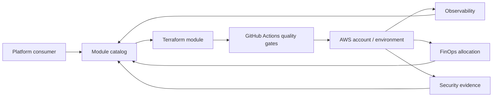

# Architecture

```mermaid
flowchart LR
  A[Platform consumer] --> B[Module catalog]
  B --> C[Terraform module]
  C --> D[GitHub Actions quality gates]
  D --> E[AWS account / environment]
  E --> F[Observability]
  E --> G[FinOps allocation]
  E --> H[Security evidence]
  F --> B
  G --> B
  H --> B
```
